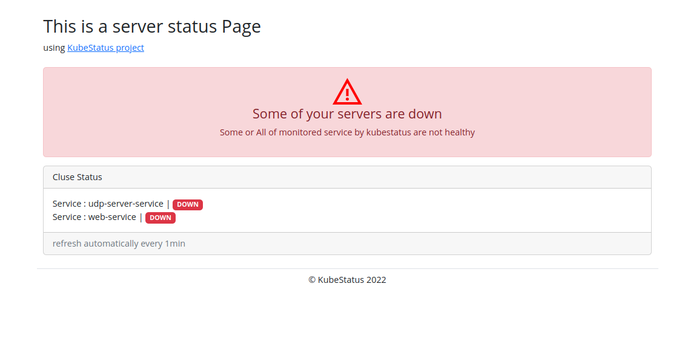

<p align="center">
  
</p>


**Kubestatus** is an free and open-source tool to easily add status page to your Kubernetes cluster that currently display the status (UP or DOWN) of services.


# Install

#### Using kubectl:

In order to run Kubestatus in a Kubernetes cluster quickly, the easiest way is for you to update the `ConfigMap` section that will hold Kubestatus configuration.

An example is provided below , do not forget to update it to add your own services while respecting the follow format:

```
LABEL=SERVICE_NAME.NAMESPACE:HEALTH_CHECK_ENDPOINT;
```

- LABEL: is the name of the service that will be displayed in status page
- SERVICE_NAME: is Kubernetes service name
- HEALTH_CHECK_ENDPOINT: if defined the endpoint will be used by Kubestatus to check health of your service. Default value is **/**

Kubestatus support multiple service make sure you add a `;` after each definition


edit a `kubestatus.yaml`:

```yaml
kind: ConfigMap 
apiVersion: v1 
metadata:
  name: kubestatus-config
data:
  services: |
    web=web-service.default;
    api=myapi-service.default;
---

```


Create k8s resources:


```sh
kubectl create -f https://raw.githubusercontent.com/soub4i/kubestatus/kubestatus.yaml
```

This configuration will create: 

 - kubestatus `Namespace`
 - kubestatus-deployment `Deployment`
 - kubestatus-service `Service`
 - kubestatus-config `ConfigMap`

#### Using helm:

coming soon

# example 

You created this web application based on nginx image.

```sh
cat <<EOF | kubectl apply -f -
apiVersion: apps/v1
kind: Deployment
metadata:
  name: nginx-deployment
spec:
  selector:
    matchLabels:
      app: nginx
  replicas: 1
  template:
    metadata:
      labels:
        app: nginx
    spec:
      containers:
      - name: nginx
        image: nginx:1.14.2
        ports:
        - containerPort: 80
EOF
```

Exposing the web application using k8s service

```sh
cat <<EOF | kubectl apply -f -
apiVersion: v1
kind: Service
metadata:
  name: web-service
spec:
  selector:
    app: nginx
  ports:
  - port: 80
EOF
```


Update the `ConfigMap` in the [kubestatus.yaml](./kubestatus.yaml) file to look:


```yaml
kind: ConfigMap 
apiVersion: v1 
metadata:
  name: kubestatus-config
  namespace: kubestatus
data:
  services: |
    Web Application=web-service.default;
```

apply the value file:

```sh
kubectl create -f kubestatus.yaml
```


now Kubestatus is installed on your cluster let's `port-forword` the Kubestatus service so we can see the status page.


```sh
kubectl port-forward service/kubestatus-service 8080:8080 
```


🚀 Now navigate to http://localhost:8080 you should see your status page like this:



## License

By contributing, you agree that your contributions will be licensed under its Apache License 2.0.